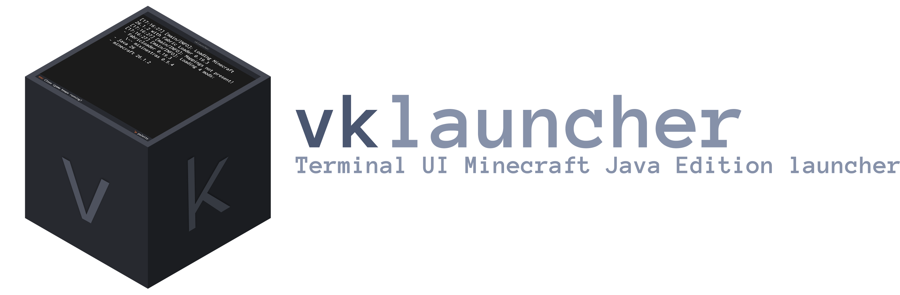

A terminal UI Minecraft Java launcher for macOS, Windows and Linux.

- Fully isolated instances with each instance having its own `mods/`,
  `saves/`, `config/`, `resourcepacks/`, `options.txt`, etc.
- Download and launch any vanilla release or snapshot
- Support for downloading Fabric and Quilt versions.
- One-click install of Modrinth modpacks (`.mrpack`) into a new isolated
  instance with automatic mod-loader installation.
- Support for offline accounts and full Microsoft account sign-in.

## Install (recommended)

Download the latest release binary

**Linux / macOS**

```bash
curl -fsSL https://raw.githubusercontent.com/vk1111111/vklauncher/main/install.sh | bash
```

**Windows (PowerShell)**

```powershell
irm https://raw.githubusercontent.com/vk1111111/vklauncher/main/install.ps1 | iex
```

Uninstall:

```bash
# Linux / macOS
curl -fsSL https://raw.githubusercontent.com/vk1111111/vklauncher/main/uninstall.sh | bash
```

```powershell
# Windows
irm https://raw.githubusercontent.com/vk1111111/vklauncher/main/uninstall.ps1 | iex
```

## Requirements

- A Java runtime installed (the launcher tries to auto-detect it via
  `JAVA_HOME` / `PATH`; you can also set an explicit path in Settings).
  Modern Minecraft (1.20.5+) needs Java 21, 1.17–1.20.4 needs Java 17,
  older versions need Java 8 — install whichever your target version needs.
- For development from source: Python 3.10+

## Run from source

```bash
python3 -m venv .venv
source .venv/bin/activate      # Windows: .venv\Scripts\activate
pip install -r requirements.txt
python3 main.py
```

## Build standalone binaries

```bash
python3 -m venv .venv
source .venv/bin/activate
pip install -r requirements.txt pyinstaller pillow
python3 build_binary.py
```

## Keybindings (main screen)

| Key   | Action                         |
|-------|--------------------------------|
| n     | Create instance                |
| enter | Launch instance                |
| d     | Delete instance                |
| r     | Rename instance                |
| x     | Browse instance files          |
| a     | Manage accounts                |
| p     | Browse & install Modrinth packs|
| s     | Instance Settings              |
| g     | Launcher Settings              |
| ctrl + q| Quit                         |

Every screen shows its own keybindings at the bottom; `esc` goes back.

## Known limitations

- No support for Forge/NeoForge
- No built-in Java installer — you need a JDK already on your system.
- Resource/texture pack and shader browsing from Modrinth isn't built in
  (only modpacks)
